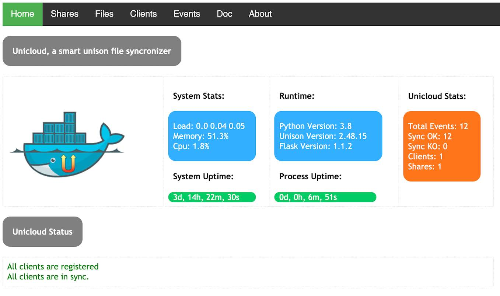

# Unicloud, a smart web unison file syncronizer

This started as a personal project a while ago until I decided it was stable and "smart" enough to make it public. I've been using unison for a long time to keep folders in sync between different computers.  I guess I never totally trusted public clouds to host my files.  At first I just added a few cron jobs on my machines and ran unison every n minutes but I felt that in this way I had lost control of it, especially when for some reasons the sync was broken.
I decided to create this project to add a web UI to unison,  monitor all sync and make it simpler to add a new replica of my files.  Add docker to  the recipe, an automatic way to manage your clients  and share your ssh keys and you'll understand the power of this tool :-)
This was one of my first python projects and I have zero to little experience with html, css and graphic design so you might find the result maybe a little old style.  I hope someone is willing to contribute and make it better.

# Features

 - Central API Server to register clients, record logs, manage shares
 - Bi-directional Sync thanks to [Unison](https://www.cis.upenn.edu/~bcpierce/unison/)
 - Log sync events
 - Simple file Manager for shares 
 - Sync Threshold warning 
 - Small memory usage and image footprint, thanks to [Alpine Linux](https://alpinelinux.org/)

## Quick start

Before you can seriously start using this tools you might want to test locally with docker-compose.   
Simply run :

    docker-compose up -d

Docker will build the image and start the project.   
Open your browser [here](http://127.0.0.1:5000/) passing credentials specified on the docker-compose file.

Wait a few seconds and the app should be up and running.   
On the homepage you will see that there are no registered clients and no shares defined.   
The test client will try to register and before you can start to sync you should first activate the client and define the `test1` share name defined on the docker compose through the `SHARE_NAME` env variable.   
When you activate a client the ssh pub key will be automatically added to the authorized key and unison will be able to sync using SSH.     
Follow the messages and the links on the homepage to complete all the required steps.   

If you want to start again fresh, simple run :

    ./local_tests/cleanup.sh
    docker-compose up -d
    

## Environment variables

|Name  |Default  |Scope  | Description
|--|--|--|--|
| TZ |Europe/Rome  |Client/Server|Timezone
| SERVER_UI_USERNAME |admin  |Server|Ui Basic Auth Username
| SERVER_UI_PASSWORD |None  |Server|Ui Basic Auth Password
| SHARES_PATH |/shares  |Server|Server Shares volume
| MAX_LOG_EVENTS |1000  |Server|Max Sync Logs to keep 
| CLIENT_HOSTNAME |$HOSTNAME  |Client|Client Hostname (see notes below)
| CLIENT_DEST |/data/share  |Client|Path of synced folder
| SERVER_HOSTNAME |None  |Client|Server Hostname
| SERVER_PORT |22  |Client|Server SSH Port to connect
| SERVER_SHARE |22  |Client|Server Share Name (not path!!)
| API_PROTOCOL |http  |Client|Api protocol: [http\|https]
| API_PORT |80  |Client|Api port
| SHARE_IGNORE |.unison  |Client|Ignore files from share, eg : .git\|.idea\|.DS_Store
| UNISON_PARAMS |None  |Client|Additional unison profile params eg : owner=false\|perms=0\|dontchmod=true
| SYNC_INTERVAL |300  |Client|Sync Interval seconds
| ROLE |client  |Client/Server|Sync Role: [client\|server]
| USER |unicloud  |Client/Server|Username for running app
| USERID |1000  |Client|Userid for running app

## Volumes and persistence

Client needs two volumes, one to persist its configuration and unison profiles/db files and one for the actual share folder to keep in sync.   

- [/data]          Unison and system configuration.   
- [/data/share]    Sync volume (can be changed with CLIENT_DEST env variable).    

Server also need two volumes:   

- [/data]          Unison and system configuration.   

- [/shares]        Shares root folder.   

It's best to have a root folder for all the shares and mount/create/configure all the others like /shares/Documents, /shares/myfiles etc.
