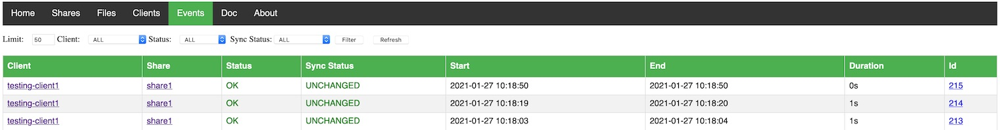

# Unicloud, a smart web unison file syncronizer

This started as a personal project a while ago but I decided to make it public. I've been using unison for a long time to keep folders in sync between different computers.
I guess I never totally trusted public clouds to host my files.  At first, like I guess everybody using unison, I just added a few cron jobs on my machines and ran unison   
every *n* minutes but I felt that I had lost control of it, especially when for some reasons the sync was broken.   
I decided to create this project to add a web interface to unison,  monitor all sync and make it simpler to add a new replica of my files and run unison on docker.  
In this way when I have a spare computer where I can run docker I just add another replica to my important files.      
The tool provide an automatic way to manage your clients through a registration process and give you a nice overview of sync events and status.   
This was one of my first python projects and I have zero to little experience with html, css and graphic design so you might find the result maybe a little old style.  
I would be happy if someone is willing to contribute and make it look more nice.   

 

# Features

 - Fast and simple way to add replicas to your files thanks to docker.
 - Central API Server to register clients, record logs, manage shares
 - Bi-directional Sync thanks to [Unison](https://www.cis.upenn.edu/~bcpierce/unison/)
 - Log sync events filtered by status, changes etc.
 - Simple file Manager for shares
 - Sync Threshold warning
 - Small memory usage and image footprint, thanks to [Alpine Linux](https://alpinelinux.org/)

 

## Quick start

**Make sure default userid(1000) is a valid id with read/write permission on your system, if not change it on the docker-compose.yml**   
 Before you can start using this tool you might want to test locally with [docker-compose](https://docs.docker.com/compose/install/).   
Simply run :

    docker-compose up -d

Docker will build the image and start the project.   
Open your browser [here](http://127.0.0.1:5000/) passing credentials specified on the docker-compose file.

Wait a few seconds and the app should be up and running.   
On the homepage you will see that there are no registered clients and no shares defined.   
Before you can start to sync, two steps are required:       
  
 - Activate the client from the [clients](http://127.0.0.1:5000/clients) page.
 - Create your first share and name it `share1` from the [shares](http://127.0.0.1:5000/shares/mgt) management page    

**The share name must match the one defined on the docker-compose by the `SERVER_SHARE` env variable.**   
The client will keep restarting until registration is completed and the share is defined, check docker-compose logs for troubleshooting.   
When you activate a client the ssh pub key will be automatically added to the authorized_keys and unison will be able to sync using SSH.   
   
      
Follow messages on the homepage to complete all the required steps.   

If you want to start again fresh, simple run :

    ./local_tests/cleanup.sh
    docker-compose up -d

 

## Environment variables

|Name  |Default  |Scope  | Description
|--|--|--|--|
| TZ |Europe/Rome  |Client/Server|Timezone
| SERVER_UI_USERNAME |admin  |Server|Ui Basic Auth Username
| SERVER_UI_PASSWORD |None  |Server|Ui Basic Auth Password
| SHARES_PATH |/shares  |Server|Server Shares volume
| MAX_LOG_EVENTS |1000  |Server|Max Sync Logs to keep
| CLIENT_HOSTNAME |$HOSTNAME  |Client|Client Hostname (see notes below)
| CLIENT_DEST |/data/share  |Client|Path of synced folder
| SERVER_HOSTNAME |None  |Client|Server Hostname
| SERVER_PORT |22  |Client|Server SSH Port to connect
| SERVER_SHARE |None  |Client|Server Share Name (not path!!)
| API_PROTOCOL |http  |Client|Api protocol: [http\|https]
| API_PORT |80  |Client|Api port
| SHARE_IGNORE |.unison  |Client|Ignore files from share, eg : .git\|.idea\|.DS_Store
| UNISON_PARAMS |None  |Client|Additional unison profile params eg : owner=false\|perms=0\|dontchmod=true
| SYNC_INTERVAL |300  |Client|Sync Interval seconds
| ROLE |client  |Client/Server|Sync Role: [client\|server]
| USER |unicloud  |Client/Server|Username for running app
| USERID |1000  |Client/Server|Userid for running app

 

## Sync

If you never used unison you should have a look first at [unison doc](https://www.cis.upenn.edu/~bcpierce/unison/download/releases/stable/unison-manual.html) to better understand how it works and why it's better than other sync tools.
It's been around since 1998 but it's still an active project and people still rely on it to secure their files.      
When you add a large share folder unison needs to index first your files. The first sync could take a while but this is totally normal, once the index is in place 
you will notice the next syncs will be very fast even for a very large folder.   

The default sync interval is 300s (5mins).  I suggest to avoid a sync interval smaller than 60seconds.       
  
 

## Volumes and persistence

Client needs two volumes, one to persist its configuration and unison profiles/db files and one for the actual share folder to keep in sync.

 - [**/data**]          Unison and system configuration.
 - [**/data/share**]    Sync volume (can be changed with *CLIENT_DEST* env variable).

Server also need two volumes:

- [**/data**]          Unison and system configuration.
- [**/shares**]        Shares root folder.

It's best to have a single shares root folder volume and then assign, mount and configure all shares as sub-folders.   
   
\+ [**/shares**]    
&ensp;&ensp;&ensp;[**/shares/share1**]    
&ensp;&ensp;&ensp;[**/shares/share2**]   
   
Shares root folder can be changed with *SHARES_PATH* env variable.   

Nothing prevents you to mount additional volumes on the server and configure them as shares on a different path, just remember to configure correctly *USERID* variable so that the application can read files.   
Shares root is also used by the file manager as root folder so if you mount on a different location you won't be able to browse files.   

 

## SSH Security

As already described ssh key exchange is done automatically when you activate a client for the first time.   
To add a little bit of security and avoid that a client could actually SSH into the server a restriction is in place to allow only unison command.   

*authorized_keys* file will have this format:      

    command="/usr/bin/unison -server" ssh-rsa AAAAB3NzaC1yc2EAAAADAQAB... CLIENT:testing-client1   
    
To add more security a chroot env could be eventually added in the future.   
   
      

## Sync Events / Thresholds

### Events
One of the most fancy feature of the app is the events section.   
You can see details about an event id, basically you will see unison logs there.   
On the event page you can filter events by different criterias.    
 
   
 
In order to keep sqlite database small events logs are purged with a daily scheduled task.   
Events are not deleted, just  the logs are replaced with a *None* .   
You can decide how many events logs you want to keep with *MAX_LOG_EVENTS* var,  default is 1000.   
 
   
 

### Thresholds

In order to have a clear view if a client is in sync you can set a sync threshold (seconds) on client configuration page.   
If you do so, you can check if a client  is *Out of Sync* on the clients page and you will see a message on the homepage warning you that one or more clients are out of sync.      

 

 

### Simple file manager
A simple file manager provided by [Flask Autoindex](https://flask-autoindex.readthedocs.io/en/latest/) is included in the project   
 

