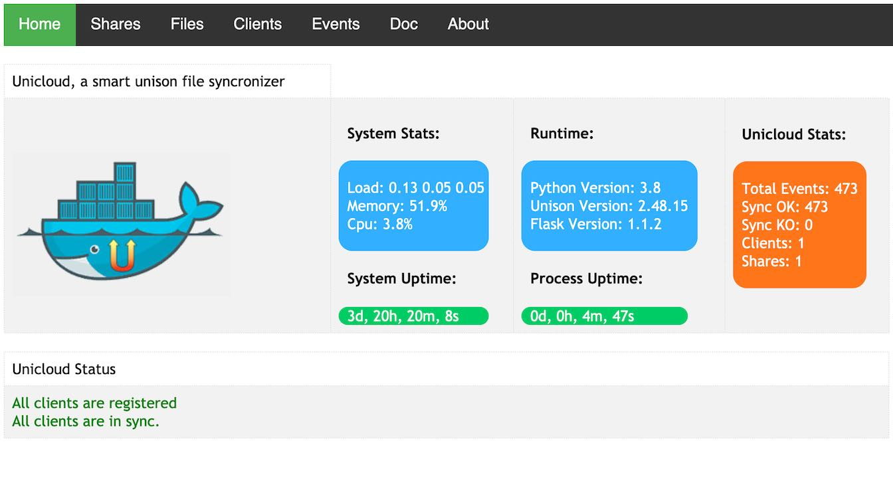
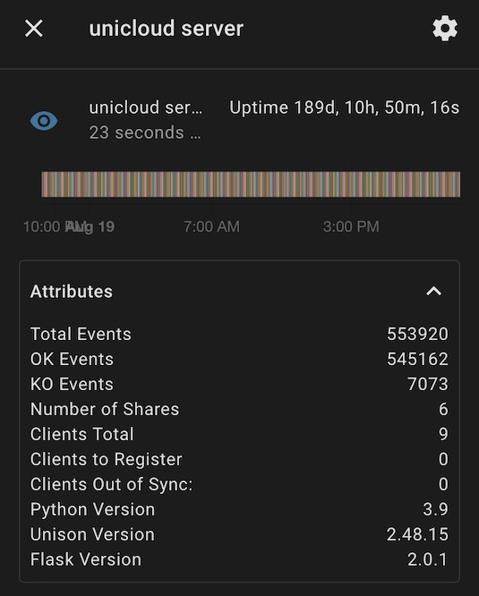

# Unicloud, a unison ui web interface and a smart file syncronizer :-)

  

This started as a personal project a while ago but I decided to make it public. I've been using unison for a long time to keep folders in sync between different computers.    
I decided to create this project to add a web interface to unison, monitor all sync and make it simpler to add a new replica of my files and run unison on docker.    
In this way when I have a spare computer where I can run docker I just add another replica to my important files.        
The tool provides an automatic way to manage your clients through a registration process and give you a nice overview of sync events and status.       
Clients can sync from a central server or from a local replica to save bandwidth.

This was one of my first python projects and I have zero to little experience with html, css and graphic design. I would be happy if someone   
is willing to contribute to redesign the interface using bootstrap.

   

# Features

- You host, you build you run!
- Fast and simple way to add replicas to your files thanks to docker.
- Central API Server to register clients, record logs, manage shares
- Bi-directional Sync thanks to [Unison](https://www.cis.upenn.edu/~bcpierce/unison/)
- Sync from local replica servers and save bandwidth syncing from the nearest replica.
- Log sync events filtered by status, changes etc.
- Simple file Manager to browse your files
- Sync Threshold Warning
- Small memory usage and image footprint, thanks to [Alpine Linux](https://alpinelinux.org/)
- Home Assistant Integration

   

## Quick start
Quick start for lazy readers :-)     
Follow below instructions or check examples folder where you can find some "ready to go" docker-compose.

Please read volume persistent requirements:

- **To work properly app need persistent volumes, check docker-compose example and documentation below about volumes for more details.**
- **Do not run docker/docker-compose as root, app will exit!!**
  **As docker best practice, add your user to docker group instead with   
  `usermod -a -G docker <your_username>`**

- **Make sure default userid(1000) is a  system valid id with read/write permission on persistent volumes, if not change `USER_UID` env var on docker-compose.yml**
  **On linux run command `id` to get your user id**

 Before you can start using this tool you might want to test locally with [docker-compose](https://docs.docker.com/compose/install/).     
Simply run :

docker-compose up -d  
Docker will pull the image from the docker hub and start the project.     
Open your browser [here](http://127.0.0.1:5001/) passing credentials specified on the docker-compose file.

Wait a few seconds and the app should be up and running.     
On the homepage you will see that there are no registered clients and no shares defined.     
Before you can start to sync, **two mandatory steps are required**:

- Activate the client from the [clients](http://127.0.0.1:5001/clients) page.
- Create your first share and name it `share1` from the [shares](http://127.0.0.1:5001/shares/mgt) management page

**The share name must match the one defined on the docker-compose by the `SERVER_SHARE` env variable.**   
The client will keep restarting until registration is completed and the share is defined, check docker-compose logs for troubleshooting.         
 When you activate a client the ssh pub key will be automatically added to the authorized_keys and unison will be able to sync using SSH.     
 Follow messages on the homepage to complete all the required steps.     

If you want to start again fresh, simple run :

./local_tests/cleanup.sh docker-compose up -d  
 

## Troubleshooting

Startup process prints everything on standard output, run

docker-compose logs   
to find useful information.    
Don't switch role between client and server as you could end up in a messy situation.     
Try to start fresh deleting data folder to create the initial configuration.    
Do not try to reinvent the wheel, Check example folder where you can find some working docker-compose files.     
If you need help create an issue providing logs and your docker-compose, I'll be happy to help.     
Windows WSL clients are known to have some issue with SSH, check older issue on the repo.     
If you can get your client to sync make sure SSH is running, a clear message will inform you if it's not.    
On server /data/log you'll find ssh debug logs among others logs.

## Server, Client and replica server
To run unicloud you need at least a server and a client.     
Server manage share files and act as API Server to register clients and sync events.    
Synchronization is done with unison through SSH.    
Since unison allows bi-directional sync an additional role exist on unicloud, a *replica server* A replica server is nothing more than a simple client which also expose SSH server allowing other clients to sync from it.       
Once a client is registered its ssh pub key is stored on server and propagated to all replica servers.    
A client can hence connect to any replica server.    
A typical scenario where you might need a replica server is where your central server is remote on internet and you have several clients on your local network.       
Instead of uploading/downloading multiple times from/to your local network you might have a lan server (always on) and some occasional clients that sync from your local server.       
This is very convenient especially if you have to sync a large amount of data.

## Environment variables

|Name  |Default  |Scope  | Description  
|--|--|--|--|  
| TZ |Europe/Rome  |[Client][Replica_Server][Server]|Timezone  
| SERVER_UI_USERNAME |admin  |[Server]|Ui Basic Auth Username  
| SERVER_UI_PASSWORD |None  |[Server]|Ui Basic Auth Password  
| SHARES_PATH |/shares  |[Server]|Server Shares volume  
| FILEMANAGER_ROOT |/shares  |[Server]|Root Folder for File Manager  
| MAX_LOG_EVENTS |1000  |[Server]|Max Sync Logs to keep  
| HOME_ASSISTANT|False|[Server]|Enable Home assistant integration  
| HOME_ASSISTANT_URL|None|[Server]|Home Assistant URL  
| HOME_ASSISTANT_PUSH_INTERVAL|60|[Server]|Home Assistant Push Interval  
| HOME_ASSISTANT_TOKEN|None|[Server]|Home assistant Long Live token  
| CLIENT_HOSTNAME |$HOSTNAME  |[Client][Replica_Server]|Client Hostname (see notes below)  
| CLIENT_DEST |/data/share  |[Client][Replica_Server]|Path of synced folder  
| SERVER_HOSTNAME |None  |[Client][Replica_Server]|Server Hostname  
| SERVER_PORT |22  |[Client][Replica_Server]|Server SSH Port to connect  
| SERVER_SHARE |None  |[Client][Replica_Server]|Server Share Name (not path!!)  
| REPLICA_SERVER_SOURCE|/data/share|[Client]|Server share Path (used only by a client connected to a replica server)  
| API_HOSTNAME |SERVER_HOSTNAME|[Client][Replica_Server]|Api Hostname, Default to Server Hostname  
| API_PROTOCOL |http  |[Client][Replica_Server]|Api protocol: [http\|https]  
| API_PORT |80  |[Client][Replica_Server]|Api port  
| SHARE_IGNORE |.unison  |[Client][Replica_Server]|Ignore files from share, eg : .git\|.idea\|.DS_Store  
| UNISON_PARAMS |None  |[Client][Replica_Server]|Additional unison profile params eg : owner=false\|perms=0\|dontchmod=true  
| SYNC_INTERVAL |300  |[Client][Replica_Server]|Sync Interval seconds  
| ROLE |client  |[Client][Replica_Server][Server]|Sync Role: [client\|server\|replica_server]  
| USER |unicloud  |[Client][Replica_Server][Server]|Username for running app  
| USER_UID |1000  |[Client][Replica_Server][Server]|Userid for running app  
| USER_GIDS |None |[Client][Replica_Server][Server]|Additional group ids for user, comma separated (eg: 33,14)

   

## Volumes and persistence

Client needs two volumes, one to persist its configuration and unison profiles/db files and one for the actual share folder to keep in sync.

- [**/data**] Unison and system configuration.
- [**/data/share**] Sync volume (can be changed with *CLIENT_DEST* env variable).

Server also need two volumes:

- [**/data**] Unison and system configuration.
- [**/shares**] Shares root folder.

It's best to have a single shares root folder volume and then assign, mount and configure all shares as sub-folders.

\+ [**/shares**] &ensp;&ensp;&ensp;[**/shares/share1**] &ensp;&ensp;&ensp;[**/shares/share2**]     
Shares root folder can be changed with *SHARES_PATH* env variable.

Nothing prevents you to mount additional volumes on the server and configure them as shares on a different path, just remember to configure correctly *USERID* variable so that the application can read files.     
Shares root is also used by the file manager as root folder so if you mount on a different location you won't be able to browse files.

   

## Sync

If you never used unison you should have a look first at [unison doc](https://www.cis.upenn.edu/~bcpierce/unison/download/releases/stable/unison-manual.html) to better understand how it works and why it's better than other sync tools.  
It's been around since 1998 but it's still an active project and people still rely on it to secure their files.        
When you add a large share folder unison needs to index first your files. The first sync could take a while but this is totally normal, once the index is in place  
you will notice the next syncs will be very fast even for a very large folder.

   

## System Backup

As of relase 1.4 a new share is created automatically called unicloud_backup    
A daily job will create a tar.gz file with all files needed in case you want to migrate the installation to a new system.    
7 backup are kept on the folder and rotated automatically.    
**Connect at least one client to this share to save backup on a remote system or download manually using file manager**

## SSH Security

As already described ssh key exchange is done automatically when you activate a client for the first time.     
To add a little bit of security and avoid that a client could actually SSH into the server a restriction is in place to allow only unison command.

*authorized_keys* file will have this format:

command="/usr/bin/unison -server" ssh-rsa AAAAB3NzaC1yc2EAAAADAQAB... CLIENT:testing-client1 To add more security a chroot env could be eventually added in the future.

        

## Sync Events / Thresholds

### Events
One of the most fancy feature of the app is the events section.     
You can see details about an event id, basically you will see unison logs there.     
On the event page you can filter events by different criterias.      
   
     
   
In order to keep sqlite database small events logs are purged with a daily scheduled task.     
Events are not deleted, just  the logs are replaced with a *None* .     
You can decide how many events logs you want to keep with *MAX_LOG_EVENTS* var,  default is 1000.     
   
     
 

### Home Assistant Integration

Why? Just because it's cool :-)     
I use home assistant for a lot of stuff so I wanted to have unicloud as entities on HA.     
I didn't have time so far to create a real integration, maybe I will consider it for the future if useful.     
As for now client/server/shares infos are published at a custom interval (HOME_ASSITANT_PUSH_INTERVAL).     
Configuration is simple, make sure you have a token and  fillup all 4 HOME_ASSISTANT_* ENV VARS.

This is the result on home assistant.

   
  
   

   
  
   

   
  
   

### Thresholds

In order to have a clear view if a client is in sync you can set a sync threshold (seconds) on client configuration page.     
If you do so, you can check if a client  is *Out of Sync* on the clients page and you will see a message on the homepage warning you that one or more clients are out of sync.

   
  
   

### Simple file manager
A simple file manager provided by [Flask Autoindex](https://flask-autoindex.readthedocs.io/en/latest/) is included in the project     
   

